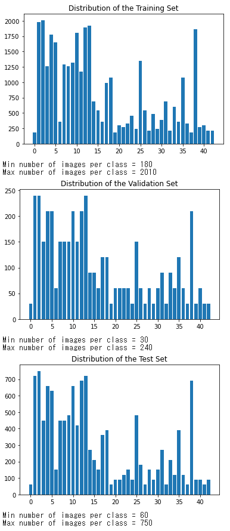
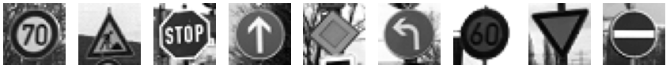
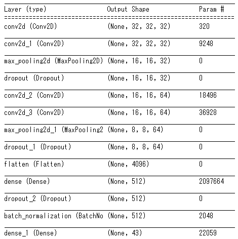
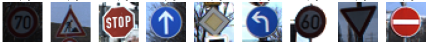

# **Traffic Sign Recognition** 

---
## Rubric Points
### Here I will consider the [rubric points](https://review.udacity.com/#!/rubrics/481/view) individually and describe how I addressed each point in my implementation.  

---
### Data Set Summary & Exploration

#### 1. Provide a basic summary of the data set. In the code, the analysis should be done using python, numpy and/or pandas methods rather than hardcoding results manually.  
I used the numpy library to calculate summary statistics of the traffic
signs data set:  
* The size of training set is 34799
* The size of the validation set is 4410
* The size of test set is 12630
* The shape of a traffic sign image is (32, 32)
* The number of unique classes/labels in the data set is 43

#### 2. Include an exploratory visualization of the dataset.  
This is an exploratory visualization of the dataset. Displaying data as a bar chart using the matplotlib library.  

### Design and Test a Model Architecture
#### 1. Describe how you preprocessed the image data. What techniques were chosen and why did you choose these techniques? Consider including images showing the output of each preprocessing technique.

As a first step, I decided to convert the image to grayscale. This is because converting to grayscale can reduce the amount of calculation and reduce the calculation time.
Here is an example of a traffic sign image before and after grayscaling.

As a last step, I normalized the image data because 
The swing width of the weight update is suppressed, and the weights are easier to converge.

#### 2. Describe what your final model architecture looks like including model type, layers, layer sizes, connectivity, etc.) Consider including a diagram and/or table describing the final model.
My final model consisted of the following layers:  

#### 3. Describe how you trained your model. The discussion can include the type of optimizer, the batch size, number of epochs and any hyperparameters such as learning rate.

To train the model, I used the type of optimizer is adam, an batch size with 512, epochs is 20, learning rate is 0.001, the type of metrics is accuracy.

#### 4. Describe the approach taken for finding a solution and getting the validation set accuracy to be at least 0.93. Include in the discussion the results on the training, validation and test sets and where in the code these were calculated. Your approach may have been an iterative process, in which case, outline the steps you took to get to the final solution and why you chose those steps. Perhaps your solution involved an already well known implementation or architecture. In this case, discuss why you think the architecture is suitable for the current problem.

##### My final model results were:
* training set accuracy of 0.9988
* validation set accuracy of 0.9776
* test set accuracy of 0.974

##### If an iterative approach was chosen:
1. What was the first architecture that was tried and why was it chosen?  

    As suggested in the lecture, I used the LeNet architecture. However, although I am immature, I wanted to use tensorflow Ver2.3, so I learned it individually and fixed it.

1. What were some problems with the initial architecture?  

    It lacked accuracy because there was no idea of ​​pre-processing grayscale processing.

1. How was the architecture adjusted and why was it adjusted? Typical adjustments could include choosing a different model architecture, adding or taking away layers (pooling, dropout, convolution, etc), using an activation function or changing the activation function. One common justification for adjusting an architecture would be due to overfitting or underfitting. A high accuracy on the training set but low accuracy on the validation set indicates over fitting; a low accuracy on both sets indicates under fitting.  

    I thought the fitting was inadequate because the training set and verification set were inaccurate. Therefore, we increased the number of convolution layers. This worked for the accuracy of the training set, but not for the validation set. To solve this problem, we built an architecture that stacks two sets of two convolution layers, a pooling layer, and a dropout layer.

1. Which parameters were tuned? How were they adjusted and why?  

    Changed the number of epochs. Loss and accuracy results during training and evaluation were visualized and adjusted to a level where the number of epochs was judged to have converged.

### Test a Model on New Images

#### 1. Choose five German traffic signs found on the web and provide them in the report. For each image, discuss what quality or qualities might be difficult to classify.  

Here are five German traffic signs that I found on the web:

Some images are dark and can be difficult to classify.

#### 2. Discuss the model's predictions on these new traffic signs and compare the results to predicting on the test set. At a minimum, discuss what the predictions were, the accuracy on these new predictions, and compare the accuracy to the accuracy on the test set.

Here are the results of the prediction:

| Image                 |     Prediction       | 
|:---------------------:|:--------------------:| 
| Speed limit (70km/h)  | Speed limit (70km/h) | 
| Road work             | Road work            |
| Stop                  | Stop                 |
| Ahead only            | Ahead only           |
| Priority road         | Priority road        |
| Turn left ahead       | Turn left ahead      |
| Speed limit (60km/h)  | Speed limit (60km/h) |
| Yield                 | Yield                |
| No entry              | No entry             |

The model was able to correctly guess 9 of the 9 traffic signs, which gives an accuracy of 100%. This compares favorably to the accuracy on the test set of ...

#### 3. Describe how certain the model is when predicting on each of the five new images by looking at the softmax probabilities for each prediction. Provide the top 5 softmax probabilities for each image along with the sign type of each probability.   

The code for making predictions on my final model is located in the 18th cell of the Ipython notebook.
The top one of all image predictions was 6.08%, and the remaining 2nd to 43rd were similarly 2.24%.
I thought it was as biased as the sample, but the results were very different.

